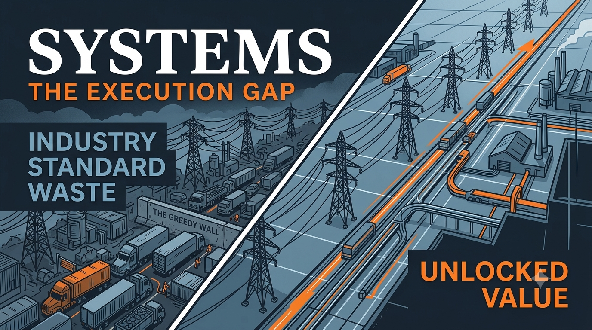

  

# Moving Beyond Industry Standard Waste

*How much of what is called "acceptable" is actually leaving value on the table? Most operations have never been asked the question in these terms.*

Every constraint-dense operation — a grid balancing supply and demand, a logistics network routing trucks, a scheduler filling a plant floor — eventually settles into a rhythm. 

Plans clear the feasibility bar. Nothing breaks. Leadership calls it efficient.

It isn't. 

It's familiar.

## The Greedy Wall

Classical optimization tools are greedy by design: they take the first workable answer and stop, because searching exhaustively for a better one costs more compute than the marginal gain seems to justify. 

That's a reasonable trade-off when the search space is small. 

At industrial scale — thousands of interacting constraints — it means the solver quits long before it finds the actual ceiling.

The result isn't a broken system. It's a working system nobody has measured against what "working better" would actually look like. 

The industry has a name for the gap: **industry standard waste.** 

The name makes it sound like a law of nature. 

It isn't. It's an artifact of where the search stopped.

## Putting a Number on It — Without Overpromising One

"Trust us, it's a lot" isn't a serious way to make an economic case. 

So the diagnostic starts with two steps that size the problem honestly, using public data, before any pilot:

**Step 1 — Total Value Locked (TVL)**

$$TVL \= {Annual System Baseline Cost} x {Estimated Waste \%}$$

The baseline cost comes from public filings or sector disclosures — not internal budgets taken on faith. 

The waste percentage is sourced from published, sector-normalized studies, not invented. 

TVL isn't the number that will be recovered. It's proof the inefficiency pool is real, sized in familiar terms.

**Step 2 — Operationally Accessible Value (OAV)**

$$OAV \= TVL x {Operational Realism Factor (ORF)}$$

ORF is a bound — a ceiling worth investigating, not a guarantee. 

Nobody knows how much of TVL is actually recoverable until it's tested against real operating conditions. Every grid, every network, every plant is different.

That honesty is the point. 

A framework that promises a fixed recovery percentage before touching data isn't confidence — it's a sales pitch wearing a lab coat.

## Where the Third Step Actually Lives

TVL and OAV size the opportunity. They don't resolve it.

The resolution is a diagnostic: running the optimizer against a window of the operator's own historical data and showing, in their own numbers, the measured gap between what happened and what the data says was achievable. 

No formula. 

No dollar figure asserted in advance. 

Just the same backtest-versus-actual methodology any serious optimization vendor would defend under scrutiny.

### **The Structural Chasm (And How to Cross It)**

The real hurdle isn't calculating TVL or OAV—any operator with a spreadsheet can run those numbers. The true chasm is the financial cost of actually *reclaiming* that value.

To wring efficiency out of a constraint-dense search space, classical solvers rely on brute force. 

Because complexity scales exponentially, finding a marginally better path requires a massive leap in compute resources. You run into a hard financial wall: the energy and time required to find the solution cost more than the value recovered. You waste a fortune just trying to prove where the waste was.

But simply throwing alternative quantum approaches at the problem doesn't solve the economics either. 

On their best days, other quantum plays carry 75% more structural weight than QuantyMize. 

On their worst days—when real-world industrial constraints get dense—those heavy architectures fail entirely. 

They lack the formulation efficiency to handle the complexity, effectively requiring QuantyMize's framework just to make the underlying hardware viable.

QuantyMize eliminates this structural bloat. By utilizing proprietary Quantum-Accelerating Algorithms, the problem isn’t just processed faster—it is mapped to the hardware with a lean design others cannot replicate.

The proof is in the scaling. 

In benchmarked testing validated against third-party reference data ([arXiv:2602.04495](https://arxiv.org/abs/2602.04495)), our model achieved a \~25x improvement in simulation and a 140x hardware output metric on the same quantum hardware.

The takeaway is simple: while classical architectures burn budgets hitting the Greedy Wall, and alternative quantum plays get choked out by their own overhead, this approach is uniquely optimized to find the operational ceiling. We deliver the execution path that actually protects the margins it's trying to recover.

---

*Learn more at quantymize.com*  
