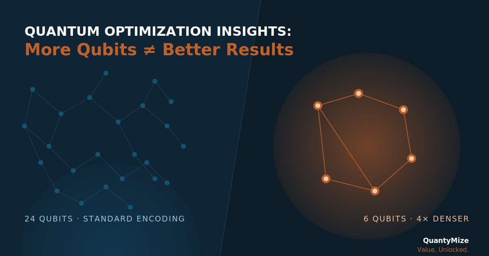
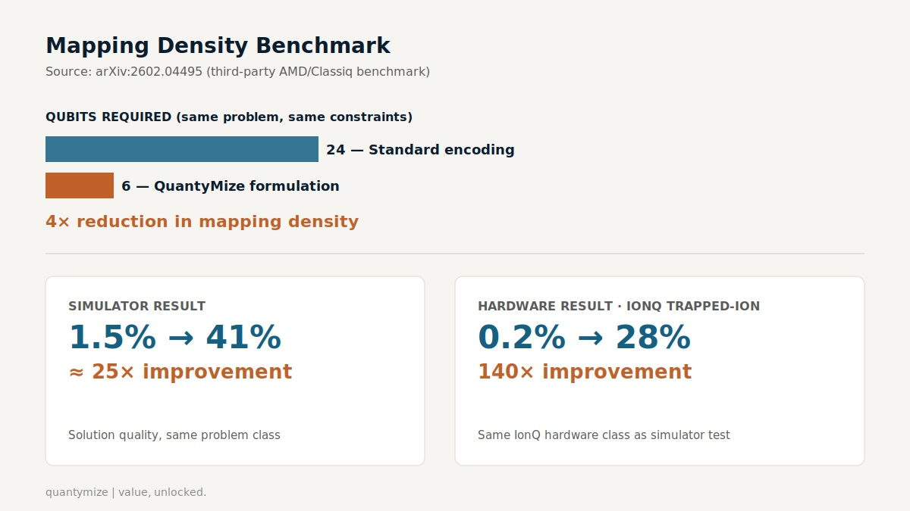

  

# More Qubits ≠ Better Results: The Mapping Density Benchmark

**QuantyMize | Quantum Optimization Insights**

## Summary

Standard QUBO-based approaches map operational optimization problems onto quantum hardware using bloated, generic encodings — consuming qubits on redundancy the underlying problem does not require. QuantyMize's formulation approach reduces this mapping density, achieving equivalent solution quality on significantly fewer qubits than a conventional baseline encoding of the same problem.

## The benchmark

QuantyMize's optimizer was benchmarked against a network routing test built on and validated against arXiv:2602.04495, *"Quantum-Based Resilient Routing in Networks: Minimizing Latency Under Dual-Link Failures"* — a third-party paper authored by AMD/Classiq. This is not a QuantyMize-authored publication; it is the sourced, third-party reference benchmark QuantyMize's qubit-efficiency claim is compared against.

### Qubit reduction

$$
\text{Efficiency Ratio} = \frac{Q_{\text{baseline}}}{Q_{\text{QuantyMize}}} = \frac{24}{6} = 4\times
$$

The same operational problem, mapped with QuantyMize's formulation, required 6 qubits versus 24 for the baseline encoding — a 4× reduction in mapping density.

  

### Simulator result

$$
\text{Simulator Improvement} = \frac{41\%}{1.5\%} \approx 25\times
$$

Solution quality on simulator rose from 1.5% to 41%, an approximate 25× improvement.

### Hardware result

$$
\text{Hardware Improvement} = \frac{28\%}{0.2\%} = 140\times
$$

On real IonQ trapped-ion hardware, solution quality rose from 0.2% to 28%, a 140× improvement. Both the simulator and hardware results were measured on the same IonQ trapped-ion hardware class, holding the physical substrate constant across the comparison.

## Why mapping density matters

A quantum optimization problem's qubit requirement is not fixed by the problem itself — it is fixed by how the problem is encoded. A generic, one-size-fits-all encoding assigns qubits to represent redundant or unnecessary state, inflating the qubit count required to represent the same decision space. QuantyMize's formulation approach removes that redundancy at the mapping stage, before the problem ever reaches the quantum processor.

This means qubit efficiency is a property of formulation quality, not hardware generation. A denser mapping extracts more usable optimization capacity from the same physical qubit count — up to 4× in this benchmark — independent of any future increase in qubit count.

## Connection

QuantyMize builds quantum-accelerating algorithms whose advantage comes from formulation density, not raw compute or qubit count. This benchmark is one instance of that qubit-efficiency claim: the constraint on quantum optimization value is rarely the number of qubits available today — it is how efficiently the problem is described to the hardware that exists.

## Citation record

- **Source paper:** arXiv:2602.04495, "Quantum-Based Resilient Routing in Networks: Minimizing Latency Under Dual-Link Failures" (AMD/Classiq, third-party).
- **Baseline:** 24-qubit standard QUBO-based encoding of the routing problem.
- **QuantyMize encoding:** 6-qubit formulation of the same problem, same constraints.
- **Simulator result:** 1.5% → 41% solution quality (~25×).
- **Hardware result:** 0.2% → 28% solution quality (140×), IonQ trapped-ion hardware.
- **Full technical briefing:** [QuantyMize-Technical-Briefing-Quantum-Routing.pdf](https://quantymize.com/wp-content/uploads/2026/07/QuantyMize-Technical-Briefing-Quantum-Routing.pdf)

---

*QuantyMize | Value, Unlocked. | quantymize.com*
