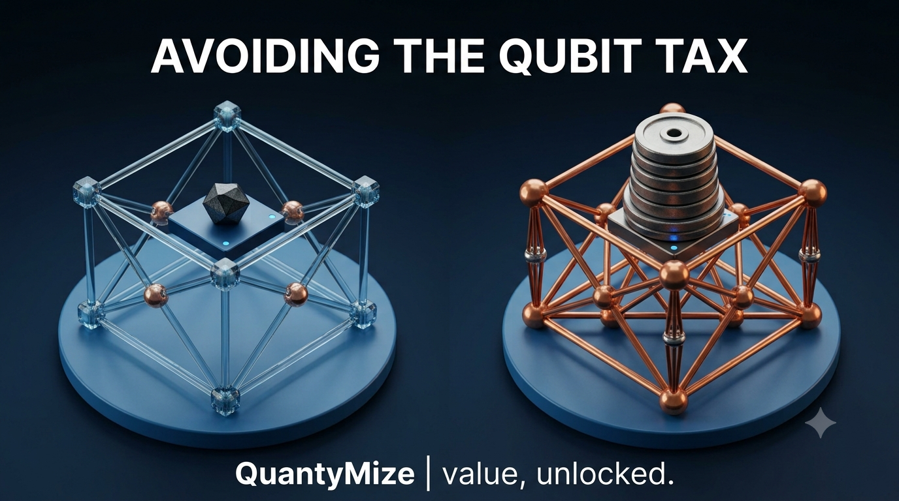

# Avoiding the Qubit Tax

**Published:** July 2026 · QuantyMize

**Summary:** Enterprise quantum adoption has stalled well short of production, per IQM's *State of Quantum 2026* report. That gap is real, but it isn't caused by any single mechanism — this piece names one narrower, design-level risk factor worth checking in individual pilots: the "Qubit Tax," the cost of mapping a problem to more qubits than it needs.

## The adoption gap

IQM's *State of Quantum 2026* ([full report](https://iqm.tech/resources/state-of-quantum-fourth-edition-2026/)) surveyed 107 senior quantum practitioners and found 89% of enterprises are now hands-on with quantum computing, while roughly 1 in 10 have reached any production deployment and only about 3% have reached real scale. The report attributes this primarily to workforce readiness, budget discipline, and the timeline to fault tolerance — not to any single technical failure mode.

## A narrower, design-level risk: the Qubit Tax

Separate from that industry-wide gap, there's a specific risk worth checking in any individual pilot: a quantum circuit mapped to more qubits than the problem strictly requires doesn't just run slower — it accumulates more noise, and that noise scales with qubit count. A demonstration can show strong success in simulation and still fail on real hardware, not because the hardware underperformed, but because the problem was over-mapped from the start. Call this the Qubit Tax: the cost, in noise and fragility, of unnecessary qubits.

This does not explain why most pilots stall industry-wide. It explains one way a specific, otherwise-promising pilot can still fail contact with real hardware.

## Benchmark

The same optimization problem, run on identical IonQ trapped-ion hardware, mapped two ways:

| Mapping | Simulator success | Hardware success |
|---|---|---|
| 24 qubits (baseline) | 1.5% | 0.2% |
| 6 qubits (efficient mapping) | 41% | 28% |

That's roughly a 25x improvement in simulator success and a 140x improvement in hardware success, from qubit-efficient mapping alone — same hardware, same problem, same day.

Full benchmark methodology: [QuantyMize Technical Briefing — Quantum Routing](https://quantymize.com/wp-content/uploads/2026/07/QuantyMize-Technical-Briefing-Quantum-Routing.pdf).

## Sources

- IQM, *State of Quantum 2026* (fourth annual industry study), June 2026.
- arXiv:2602.04495 — third-party (AMD/Classiq) benchmark research; independently verified, not QuantyMize-authored.

## Related

Part of QuantyMize's ongoing series on qubit efficiency and problem structuring. No cross-links per standing GitHub content policy.
