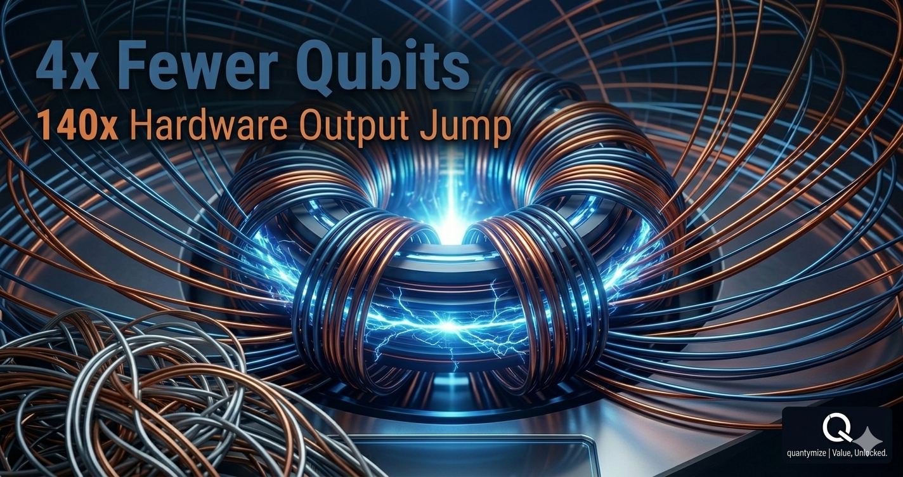
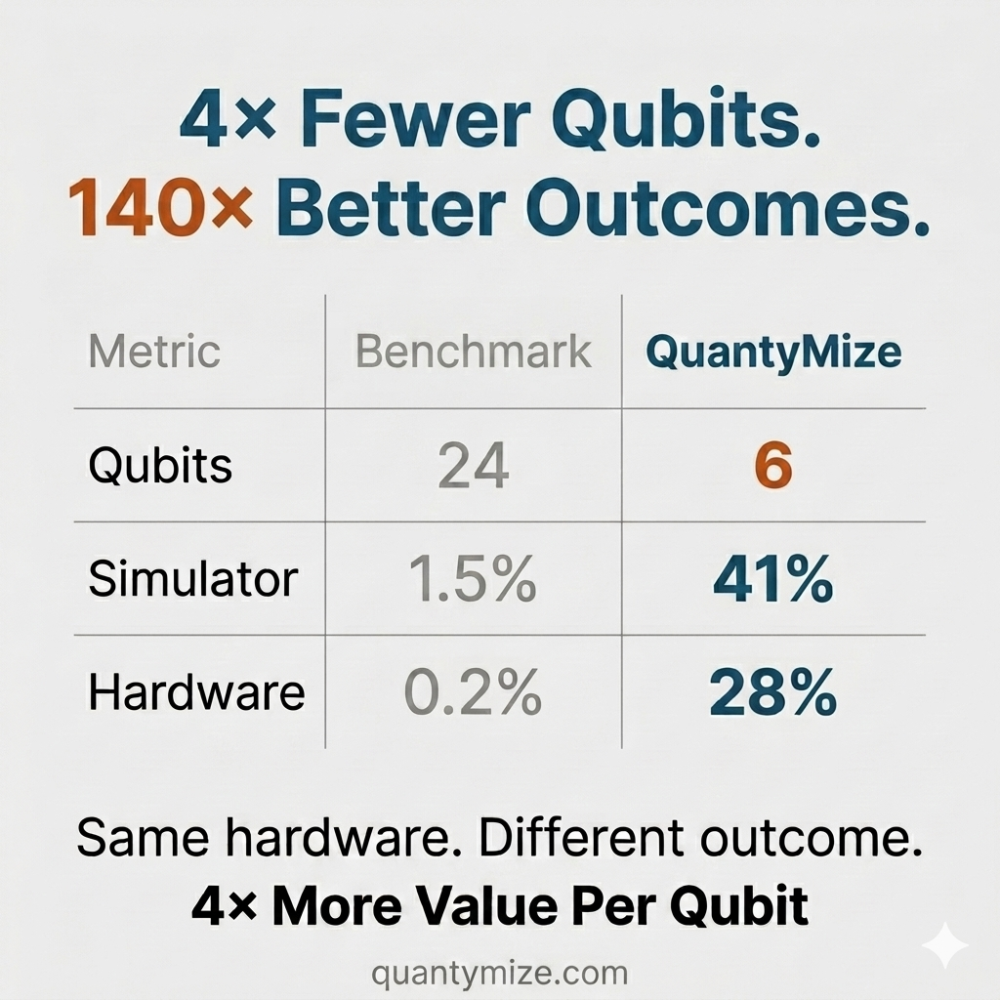

# 4x Fewer Qubits, 140x Better Outcomes: Formulating for Near-Term Quantum Value

## I. Executive Summary & Benchmark Core

Most quantum-based optimization efforts do not suffer from a physical hardware problem. They suffer from a **formulation problem**.

In a recent resilient routing benchmark, enterprise telecom operators faced the complex challenge of balancing latency, multi-point redundancy, and dynamic failure tolerance across active networks. 

A standard published baseline approach required $24\text{ qubits}$, yielding a meager $1.5\%$ simulator success rate and a completely unusable $0.2\%$ real hardware success rate. By reformulating the exact same optimization problem architecture, QuantyMize executed the workload using **4x fewer qubits** ($6\text{ qubits}$ instead of $24\text{ qubits}$) on the exact same physical hardware platform.

---

## II. Algorithmic Yield & Hardware Evaluation Matrix

Because our compact formulation represents complex problem architectures exponentially more efficiently, the resulting performance jump is stark. The baseline data versus the QuantyMize Algorithmic Yield Engine tracks as follows:

| Optimization Metric | Baseline Benchmark (IonQ Trapped-Ion) | QuantyMize Approach (IonQ Trapped-Ion) | Performance Delta (Algorithmic Multiplier) |
| :--- | :---: | :---: | :---: |
| **Physical Resource Footprint** | $24\text{ Qubits}$ | $6\text{ Qubits}$ | **$4\times\text{ Less Resource Bloat}$** |
| **Ideal Simulator Success Rate** | $1.5\%$ | $41.0\%$ | **$\approx 27.3\times\text{ Efficiency Gain}$** |
| **Physical Hardware Yield Rate** | $0.2\%$ | $28.0\%$ | **$140.0\times\text{ Production Jump}$** |

> **Source Verification Note:** Baseline hardware performance metrics are extracted and audited against the peer-reviewed quantum routing methodology found in the open-source archive: `https://doi.org/10.48550/arXiv.2602.04495`. Both runs were executed natively on identical IonQ trapped-ion hardware infrastructure.

Nothing about the physical hardware computer changed. **The only variable altered was how the constraint problem was mathematically expressed.**

  

---

## III. Operational Insights for the Performance Architect

When problem representation density is maximized, enterprise operators transition from experimental physics pilots to decision-grade execution.

* **Full-Scope Constraint Coverage:** Bypasses the need to artificially clip or truncate dense problem fields to fit hardware limits.
* **Hardware Noise Mitigation:** Reducing active qubit requirements drastically lowers cross-talk error and physical decoherence vulnerabilities.
* **Production-Grade Outputs:** Converts an unstable experimental signal into clean, defensible, operational solutions.

Fewer physical qubits can produce radically stronger outcomes because the **efficiency of problem representation determines real-world performance**. QuantyMize focuses entirely on extracting maximum yield from existing, current-generation hardware infrastructure—eliminating the passive operational strategy of waiting for future hardware scale.

That is the definitive boundary between a fragile proof of concept and a usable enterprise result.

---

### Call to Action & Enterprise Intake
👉 Learn more at [quantymize.com](https://quantymize.com)
